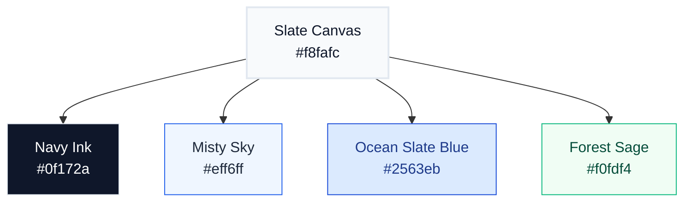

# ⚖️ VibeFrames Brand Book & Design System
## Identity Concept: *Soothing Ocean Slate*

This document defines the official visual identity, token architecture, and user experience signature for **VibeFrames**.

The VibeFrames visual signature—**Soothing Ocean Slate**—is inspired directly by spacious, clean, and highly trustworthy professional platforms (such as `hellointerview.com` and `meta.com`). The goal is an extremely calming, airy, and "unrushed" design that combines elegant, geometric sans-serif shapes with deep slate-navy typography, clean grid borders, and comforting misty-blue accents.

---

## 🎨 1. Core Color System

Our color architecture uses soft, low-saturation, cool and clean light slate tones to reduce visual clutter and create a relaxing, professional workspace.

### 🎨 Color Tokens (Soothing Slate-Blue)

| Token | Hex / OKLCH | Purpose | Brand Experience |
| :--- | :--- | :--- | :--- |
| `bg-canvas` | `#f8fafc`   `oklch(0.985 0.005 240)` | **Slate Canvas** | Soothing, clean light slate-white background. Provides a spacious, anti-glare, and relaxed tone. |
| `bg-surface` | `#ffffff`   `oklch(1 0 0)` | **Pure Ivory** | Clean card and editor panel surfaces, creating sharp visual definition. |
| `border-subtle`| `#f1f5f9`   `oklch(0.96 0.005 240)` | **Misty Thread** | Softest border lines and divider rules. |
| `border-default`| `#e2e8f0`   `oklch(0.92 0.008 240)` | **Soothing Slate** | Standard borders for input elements, sliders, and timeline frames. |
| `text-primary` | `#0f172a`   `oklch(0.13 0.02 240)` | **Deep Navy** | Extremely professional deep slate-navy for maximum text readability. |
| `text-muted` | `#64748b`   `oklch(0.55 0.015 240)` | **Muted Slate** | Cool slate-grey for helper descriptions, labels, and secondary details. |
| `accent-primary`| `#2563eb`   `oklch(0.45 0.22 240)` | **Ocean Blue** | Professional, soothing ocean blue for primary buttons and sheens. |
| `accent-light` | `#eff6ff`   `oklch(0.965 0.015 240)`| **Misty Sky** | Faint, soothing blue backdrops for active highlight boxes. |
| `status-success`| `#10b981`   `oklch(0.65 0.2 140)`  | **Forest Sage** | Calming sage-green exclusively for successful test executions. |

### 🌗 Dark Mode Shift
In dark mode, the tokens shift symmetrically into a clean night-mode terminal:
*   **Background**: Soothing absolute charcoal (`#09090b` / `oklch(0.145 0 0)`).
*   **Surfaces**: Elevated obsidian card blocks (`#18181b` / `oklch(0.205 0 0)`).
*   **Primary text**: Crisp warm chalk white (`oklch(0.985 0 0)`).
*   **Borders**: Translucent white boundaries (`oklch(1 0 0 / 10%)`).

---

## ✍️ 2. Clean Geometric Typography

VibeFrames utilizes a modern, spacious sans-serif typography pairing to project clarity, engineering precision, and a highly polished product feel:

*   **Editorial Headings**: `Geist Sans` (Weights `700` to `900`, `font-sans font-extrabold tracking-tight`). Designed to match the modern geometric lines of next-gen developer tools.
*   **Body & UI Text**: `Geist Sans` (Weights `300` to `600`, `font-sans font-normal`). Clean, high-legibility layout controls and spacious chat dialogue.
*   **Schemas & AST details**: `Geist Mono` (`font-mono`). Monospaced text blocks for Zod parameter tables and timeline serializations.

---

## 🔲 3. Spacious Layout & Spacing Rules

To ensure an "unrushed" user experience, VibeFrames implements strict spacing and border rules:

*   **Spacious Padding**: Cards, bubbles, and panels utilize large internal spacing (`p-5`, `p-6`, `p-12`) to allow components to breathe.
*   **Subtle Grid Lines**: Borders are kept exceptionally thin (`1px`) and set to `#e2e8f0` (soothing slate) to provide structural guidance without looking busy.
*   **Colored Backdrop Blurs**: We use very faint, soothing gradient highlights to separate information panels and direct focus smoothly:
    *   *Chat editing*: Faint soothing sky-blue blur (`to-blue-50/20`).
    *   *Code compiler*: Faint misty slate-blue blur (`to-sky-50/20`).
    *   *Harness runtime*: Faint calm indigo-blue blur (`to-indigo-50/15`).
    *   *Unit testing*: Faint soft sage-green blur (`to-emerald-50/20`).

---

## ⚡ 4. SNAPPY Motion & Tactile Soundscape

UI transitions and animations inside the video canvas follow physical, snappily weighted, and intentional mechanics:
*   **Snappy Decelerations**: Standard micro-interactions use swift, snappy ease curves (`ease-out` in CSS or `power4.out` in GSAP).
*   **Weighted springs**: Exclusively reserved for popping badges (`back.out(1.4)`).
*   **SFX Triggers**: Paired with typewriter taps (`typing.mp3`), tool clicks (`click-soft.mp3`), and high-end crystalline chime alerts (`chime.mp3`) for satisfying tactile feedback.

---

## 🙏 Credits & Inspiration

VibeFrames' visual identity stands on the shoulders of work by others. None of the
following implies endorsement by, or partnership with, any of the named parties —
this section exists for transparency and gratitude.

### Typography
* **[Geist Sans](https://vercel.com/font) + [Geist Mono](https://vercel.com/font)** — by Vercel, Inc.
  Licensed under the [SIL Open Font License v1.1](https://github.com/vercel/geist-font/blob/main/LICENSE.TXT).
  Used unmodified, with the "Geist" Reserved Font Name preserved per OFL §3.
  Vercel® is a trademark of Vercel, Inc. — we use only the open-source font, not
  the trademark or brand.

### Design inspiration
* **[hellointerview.com](https://www.hellointerview.com)** — for the editorial,
  unrushed, deep-navy-on-paper sensibility that informs our **Soothing Ocean
  Slate** palette and spacious layout discipline.
* **[meta.com](https://about.meta.com)** — for the calm corporate-but-warm
  geometric type usage and content-first information density.
* **[Vercel's product surfaces](https://vercel.com)** — for the soft-pill button
  geometry, generous whitespace, and "flat surfaces over heavy shadows"
  philosophy reflected in our component shape language.

### What this means
Design tokens (color hex values, font sizes, spacing scales, border radii) are
facts and **not copyrightable**. Adoption of conventions like "Geist body text,
pill primary buttons, light editorial spacing" reflects modern product-design
common practice across many sites and is freely usable. Our prose, color
*combinations*, naming ("Soothing Ocean Slate", "Misty Sky", etc.), and overall
expression are original to VibeFrames.

If you build on top of VibeFrames, you inherit our [MIT License](./LICENSE) for
the code; for the Geist fonts, you inherit the [OFL 1.1](https://github.com/vercel/geist-font/blob/main/LICENSE.TXT)
terms directly from Vercel.
