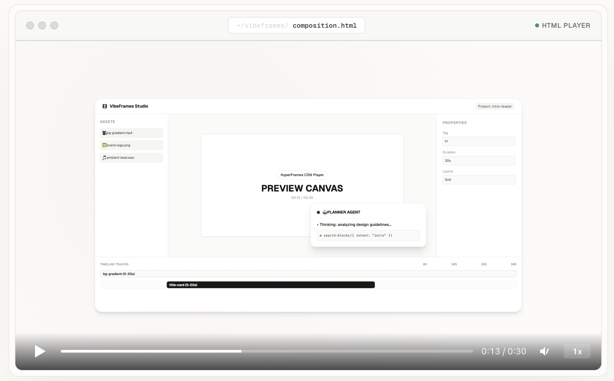

# 🎬 VibeFrames

> **A Mastra Harness agent that composes videos through conversation.** 
> You describe what you want. The agent reasons, calls tools, and builds a [HyperFrames](https://github.com/heygen-com/hyperframes) composition—clip by clip, track by track—while you watch in real time.



<div align="center">

[](./LICENSE)
[](https://nextjs.org)
[](https://github.com/heygen-com/hyperframes)
[](https://mastra.ai)

</div>

---

## ✨ The Vision

Traditional video editing is tedious, slow, and click-heavy. **VibeFrames** reimagines the video creation process by introducing a collaborative AI partner. You don't drag-and-drop or fight with complex timelines—you simply **vibe and describe**. 

By pairing the reasoning capabilities of state-of-the-art LLMs with a robust, deterministic, HTML-native video player (**HyperFrames**), VibeFrames lets you edit videos via pure dialogue, streaming visual changes instantly to your screen.

---

## 🚀 How It Works

```
  ┌──────────────┐    chat     ┌──────────────┐    tools    ┌──────────────┐
  │              │   ──────►   │              │   ──────►   │              │
  │     You      │             │    Mastra    │             │  HyperFrames │
  │   describe   │             │   Harness    │             │   (render)   │
  │   a video    │   ◄──────   │   agent      │   ◄──────   │              │
  │              │    SSE      │              │   compose   │              │
  └──────────────┘   events    └──────────────┘    tree     └──────────────┘
```

1. **You describe your idea:** *"Add a sleek neon title slide with a purple-to-blue gradient and type write 'Welcome to the Future'."*
2. **Mastra Harness reasons:** The agent maps the request to the appropriate mode (`plan` or `vibe`) and determines the required action.
3. **Tools mutate the tree:** Fine-grained, typed tool calls modify a canonical composition tree (fully validated via Zod schemas).
4. **HyperFrames renders in real-time:** The tree is immediately pushed to a `<hyperframes-player>` web component inside the browser.
5. **SSE streaming:** Reasoning tokens, tool logs, and state updates stream back to the frontend in real time, keeping the user in the loop.

---

## 🛠️ The Tech Stack

| Layer | Technology | Why It Fits |
| :--- | :--- | :--- |
| **Agent Runtime** | [Mastra](https://mastra.ai) Harness | Multi-mode reasoning, unified state, typed toolkits, and an integrated event bus out of the box. |
| **Video Engine** | [HyperFrames](https://github.com/heygen-com/hyperframes) | HTML-native, deterministic, and highly structural—ideal for AI-driven generation. |
| **Model** | OpenAI `o4-mini` via [AI SDK](https://sdk.vercel.ai) | Blazing fast reasoning and excellent structure-following at low cost. |
| **Framework** | Next.js 16 (App Router), React 19 | Server-Sent Events (SSE) route handlers, Server Components, and smooth reactivity. |
| **Testing** | Vitest + React Testing Library | TDD workflow — tests are the spec, written before implementation. |
| **UI Styling** | shadcn/ui (base-nova) + Tailwind v4 + MagicUI | Light-mode-first aesthetic with shimmer, border-beam, and shiny-text micro-animations. |

---

## 🗺️ Project Roadmap & Status

VibeFrames is structured around a rigorous design-first lifecycle. All core architecture decisions are documented in detail within the repository.

```
  DESIGN PHASE  ──────────────────────────────────────────
  ✅  M0: Origin & Idea (Scaffolding, Core Vision)
  ✅  M1: HyperFrames Exploration (CDN Player, Block Catalog)
  ✅  M2: Mastra Primer (LLM, Agents, Tools, Memory)
  ✅  M3: Harness Design (Lifecycle, State Stores, Event Bus)
  ✅  M4: VibeFrames Harness VHLD (State Schema, Twin-Mode Flow)
  ✅  M5: High-Level Design (SSE transport, Render Pipeline)
  ✅  M6: Tech Stack & Architecture Decision Records (ADRs)
  ✅  M7: UI/UX system design (Dark theme palettes, wireframes)

  BUILD PHASE  ───────────────────────────────────────────
  ✅  M8: Core Scaffold, Studio UI & TDD Foundation    👈 [Just shipped]
  ⏳  M9: Harness Loop End-to-End Integration
  ⬜  M10: Full Interactive Studio + Canvas + Tool Suite
  ⬜  M11: Persistence, Project Management & Auth
  ⬜  M12: Performance Polish, Micro-animations & Dev Deploy
  ⬜  M13: Production Launch
```

---

## 📖 Deep Dive Into the Architecture

Before writing a single line of application code, we designed every layer. The repository contains extensive architectural documentation:

*   **[`docs/README.md`](./docs/README.md):** The starting guide to all technical docs.
*   **[HyperFrames Exploration](./docs/01-hyperframes-exploration.md):** Understanding the video block structure.
*   **[Mastra Primer](./docs/02-mastra-primer.md):** The bottom-up agentic building blocks.
*   **[Harness deep-dive](./docs/03-harness-why-what-how.md):** State management patterns and event pipelines.
*   **[Our Harness design](./docs/04-our-harness-vhld.md):** The dual-mode (plan + vibe) state machine.
*   **[HLD — tools & flows](./docs/05-hld-tools-flows.md):** Server-Sent Events protocol and composition pipeline.
*   **[Tech stack](./docs/06-tech-stack.md):** Decisive structural choices and future upgrade plans.
*   **[UI exploration](./docs/07-ui-system.md):** Typography, color-palettes, and canvas styling.
*   
*   **Architecture Decision Records (ADRs):**
    *   [ADR-001: SSE Chat Transport](./docs/decisions/ADR-001-sse-chat-transport.md)
    *   [ADR-002: LLM Provider Reasoning](./docs/decisions/ADR-002-llm-provider-reasoning.md)
    *   [ADR-003: Storage Strategy](./docs/decisions/ADR-003-storage-strategy.md)

---

## ⚡ Quick Start

```bash
git clone https://github.com/akashp1712/vibeframes.git
cd vibeframes
pnpm install
cp .env.example .env.local   # add your OPENAI_API_KEY
pnpm dev                      # → http://localhost:3000
```

See **[DEVELOPMENT.md](./DEVELOPMENT.md)** for full local development guidelines.

### Run tests

```bash
pnpm test          # single run
pnpm test:watch    # watch mode
pnpm typecheck     # type-check without emit
```

### Explore the architecture

Open [`docs/README.md`](./docs/README.md) for the full design system and specs.

---

## 🛡️ License

Distributed under the [MIT License](./LICENSE).
